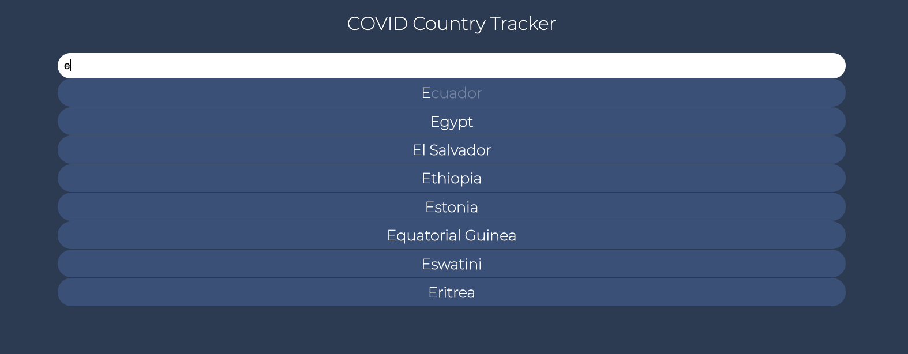

### Seek & Sport

```
App to get stats on COVID based on Country.

Features:
    SearchBar (Typeahead):
        - Keyboard to select countries.
        - Also on mouseover.
        - Letters not typed will be displayed differently.
```

### Getting Started

```
These instructions will get you a copy of the project up and running on your local machine for development and testing purposes.

Go to the server directory. Run npm install/yarn install followed by npm start/yarn start. The server will be running on port 4000

Go to the client directory. Run npm install/yarn install followed by npm start/yarn start. Accept to listen to FE on port 3000
```

### Flow for user.

`Home`


`Statistics`


### Prerequisites

```
-node.js, npm/yarn
```

### Built With

```
Node.js - Backend
React - FrontEnd
```

### Authors

```
Manider Dheer.
```

### License

```
This project is licensed under the MIT License - see the LICENSE.md file for details
```
